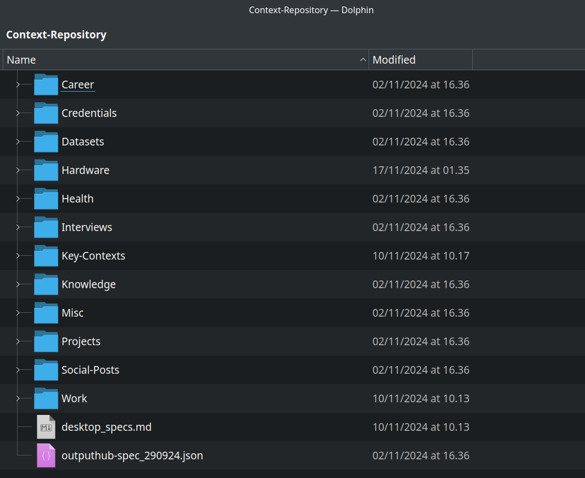
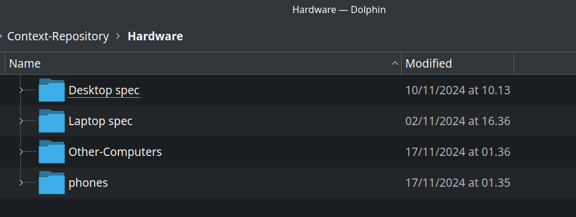
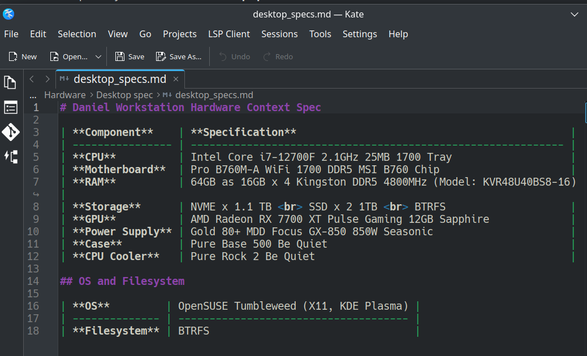
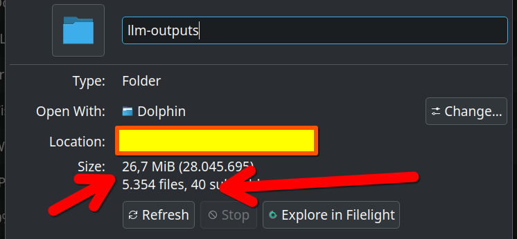

## Organising A Repository For LLM Work

These are the "things" that I continue to see as the buliding blocks for working with LLMs in a way that attempts to be methodical and suitable for replicating results:

## Organising Inputs

### Prompts

Prompts are the inputs to large language models (LLMs).

But - *when you crack your head thinking about it*- they're not really the *only* input to LLMs.

If you combine your input with a piece of context, you have *two* inputs: the prompt (instructions) and the context that you've injected.

This context could be what I call a "context snippet". Or it could be information retrieved from an integration, whether used by UI or script.

Much LLM work is context-agnostic. Some of it is done using proprietary systems for maintaining context over conversations. Ie, while prompts are usually necessary, context isn't. We can think of prompts as the *prime* inputs.

### Contextual Snippets

The second important input to LLM work is contextual data.

Context can be delivered through memory systems or RAG. Or it can (often) just be provided by inserting files into "chats" - often through easy mechanisms like drag and drop and - if the API supports it - by referencing a filepath in a prompt script.

To support the first use-case, I've developed a library of what I call context snippets: these are simply `json` or `.md` files that contain snippets outlining small details of context that I don't want to have to type out again and again:





Here's a context snippet that I use a lot: it lists the components of my desktop. I can drop it into a chat to ask any LLM to recommend (say) a hardware component and immediately receive an output that is individualised to my needs.



### Storing Outputs

Storing outputs is a more divisive topic than storing prompts!

Consider this:

While there are a *few* good tools on the market for managing prompt libraries (to the best of my knowledge, at the time of writing) nobody has yet developed a powerful and robust tool for managing outputs in storage (say, a wiki or knowledge base). As a passion project, I'm working on my own. But don't hold your breath just yet!

Despite this, there's nothing inherently difficult about storing the outputs of large language models (LLMs). To the contrary, it's really easy and really scalable. 

In the grand scheme of things, LLM outputs (which usually come formatted in markdown) "weigh" almost nothing. I have a folder of more than 5,000 outputs that's only about 25 `Mb` in size ... and much of that is images!

As you can see: the data is *really, really* light!



### Why Store LLM Outputs?

I'd actually argue that there are bundles and bundles of reasons why storing at least some of your LLM outputs makes sense!

To start with the most obvious: they might contain highly useful information that you might wish to retain for later reference. 

Beyond that:

- When you begin to amass enough of them, you can mine your own LLM output data. For example, you can use an LLM on top of your LLM archive to mine your outputs folder for actionable tasks. 
- You can perform topic cluster analysis and link up ideas  
- You can use the LLM outputs as a bank of training data for fine-tuning your own models  
- You can share them with others who might find them helpful  
- You can use them as context in further prompts ("take this output .. can you find more ideas?")

## Storing Agent/Assistant Configurations

Many platforms offer users the ability to create custom LLM "assistants" (see: custom GPTs for a consumer implementation).

These are instructions that will persist between chats. You can create them with developer platforms too so that whenever you chat with a specific assistant it has some knowledge or configuration parameters baked into it. 

To centralise your store of information, these should be stored and version controlled.

## Useful bits and pieces

A simple Github repository can be a great way to collaborate on prompting experiments and use-cases. 

You can consider adding:

- Notes  

## Other possible storage entities (advanced usage)

At my current stage of working with LLMs, the following file structure covers almost all of my needs (prompts, outputs, agent configs, contextual data).

So a basic folder structure goes something like:

```
llm-project/
├── prompt-library/
│   ├── classification-prompt.md
│   ├── summarization-prompt.md
│   ├── chatbot-conversation-prompt.md
│   └── code-generation-prompt.md
├── saved-outputs/
│   ├── classification-output.json
│   ├── summarization-output.txt
│   ├── chatbot-session-1.log
│   └── code-generation-output.py
├── context-data/
│   ├── knowledge-base-articles/
│   │   ├── article-1.txt
│   │   └── article-2.txt
│   ├── user-profiles/
│   │   ├── user1-profile.json
│   │   └── user2-profile.json
│   └── historical-conversations/
│       ├── conversation-1.log
│       └── conversation-2.log
├── agent-configs/
│   ├── chatbot-config.yaml
│   ├── summarizer-config.yaml
│   └── classifier-config.yaml
```

However, your'e not me, and your needs might be more complex. 

You might also wish to store:

- Model files 
- Datasets used for training  
- Experiment result  
- Evaluation metrics and testing  
- External data and knowledge 

If you're developing fine-tuned models, though, or conducting extensive post-deployment monitoring and evaluation, I would suggest that it makes more sense to store and version that data separately from this data structure which is really just intended to create an efficient day-to-day workspace for LLM operations.

## Model folder structure for more advanced use

```markdown
LLM_Prompt_Engineering/
├── prompt_development/
│   ├── prompts/
│   │   ├── general/
│   │   │   ├── prompt_general.json
│   │   ├── fine_tuning/
│   │   │   ├── prompt_fine_tuning.json
│   │   ├── evaluation/
│   │       ├── prompt_evaluation.json
│   ├── templates/
│       ├── prompt_template.md
├── fine_tuning/
│   ├── configs/
│   │   └── config.json
│   ├── datasets/
│       └── dataset.csv
├── evaluation/
│   ├── reports/
│   │   ├── markdown/
│   │       └── evaluation_report.md
│   │   ├── json/
│           └── status.json
├── logs/
│   └── fine_tuning_logs.txt
└── version_control/
    └── changelog.md
```
