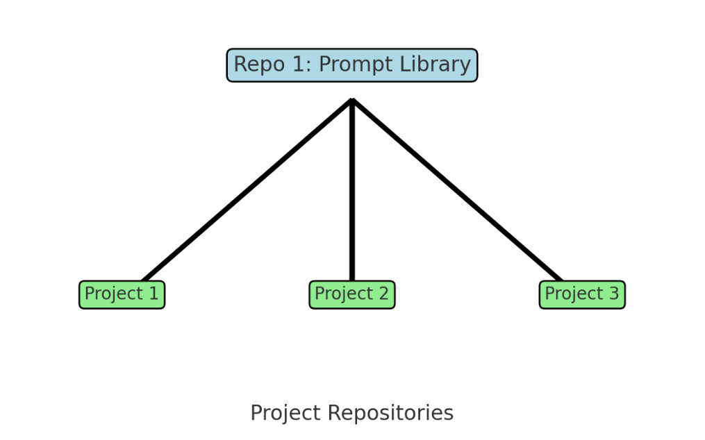
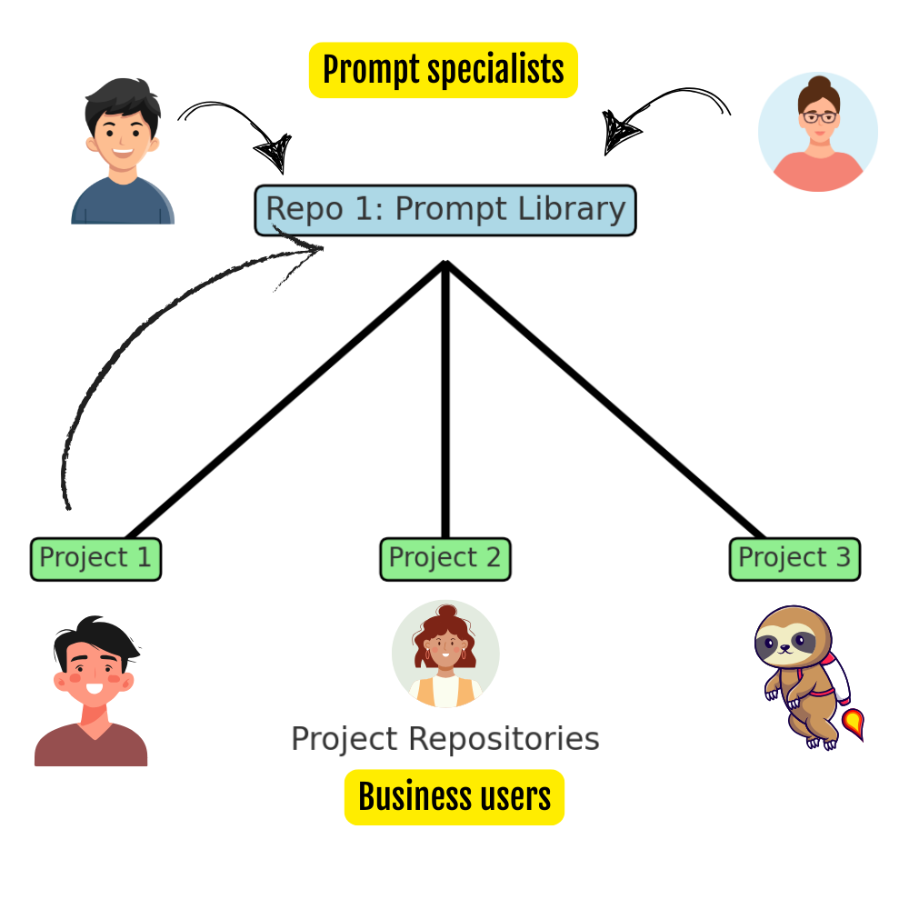
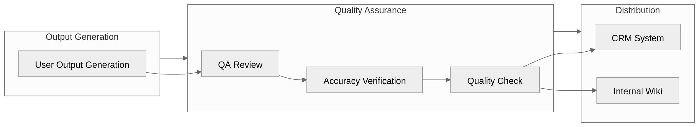
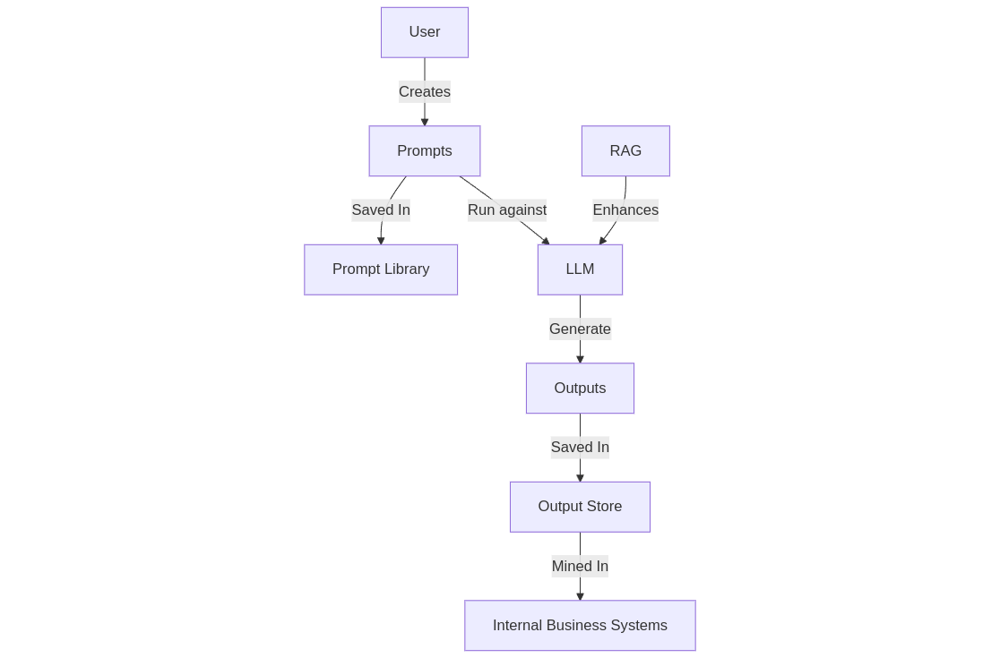
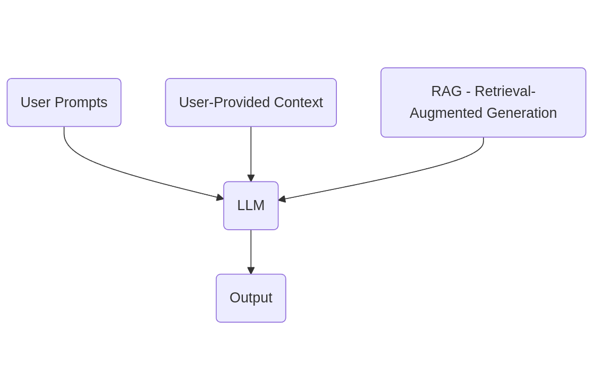

# Github-based workflows

## "Hub and spoke" Github prompting setups

If you're frequently spinning up new repositories for managing projects involving LLMs, then templating is definitely an area worth exploring. I'm actively doing so although I'm perpetually torn between the familarity of working with Github and the feeling that "*I should really be using like ... a specific 'thing' for this workflow*. 

But if you've also run out of enthusiasm for digging through the latest SaaS-whatever, then much can be achieved through simply using Git repositories.

## Repository set up for collaborative prompting workflows

If you're working in a collaborative setup with different people working on projects but drawing from a shared repository of prompts, you could:

- Establish a repository for the prompt library  
- Establish individual repositories for specific projects  
- Using submodules, pull from the prompt library into specific projects  

Of course, if you're working on multiple projects with the same prompt library, it would be easier to just clone a (single) copy of the prompt library so that you don't need the hassle of submodules. 

A nice advantage of this model is that different user groups can collaborate in different ways:

- Resources focused on prompt engineering can manage a prompt library  
- Individual business users might contribute also  
- More resources could pull from the library for projects  

## Outputs workflow

When the outputs of generative AI tools finally get their day in the sun (it will happen), attention will need to be given to how to process and manage LLM *outputs* too.

A basic workflow could be something like:

- User(s) generate output via LLMs  
- Prompt outputs get gathered/recorded into central repository  
- Outputs pass through QA and if appropriate are developed by humans and integrated into internal tools like CRMs, KM systems, etc.  

# The role of context & RAG

Finally we get to RAG which provides context for the LLM.

A full workflow which integrates of all the aspects discussed in this repository might look something like this:

- A user(s) interacts with large language models (LLMs). They do so by writing *prompts*  and (sometimes) adding *contextual data*  
- The prompts are versioned in a *prompt library* and reused. In this way, the prompts themselves can actually hold little bits of *context*!  
- The prompts are run against an LLM. It is enhanced by a RAG pipeline which adds further *context* in the form of data beyond that it was exposed to during training which is stored by the organisation in a vector database.  
- The LLM uses these inputs to generate *outputs* which are then stored in an *output store*. 
- The *output store* can be used in internal business systems.

The whole process.

 

And if we think broadly about what's really going *into* the LLMs, we might come up with a diagram that looks something like this:

